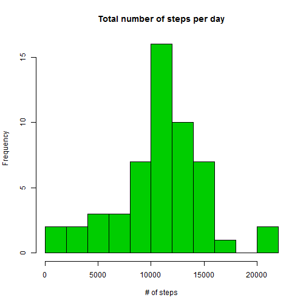
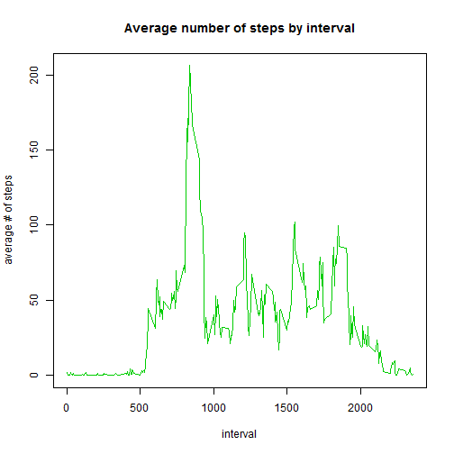
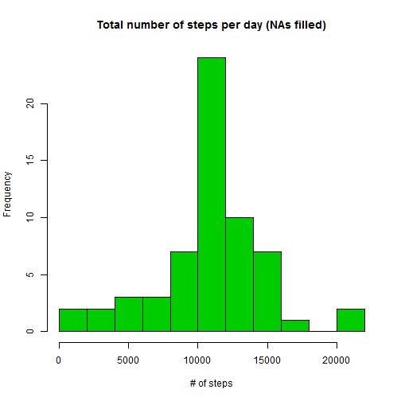
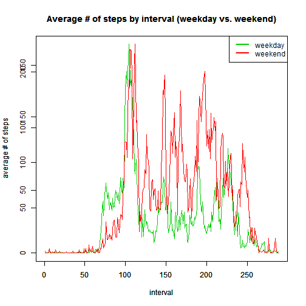

Reproducible Research: Activity monitoring data
========================================================

# Load required libraries


```r
library(dplyr)
```

```
## 
## Attaching package: 'dplyr'
## 
## The following objects are masked from 'package:stats':
## 
##     filter, lag
## 
## The following objects are masked from 'package:base':
## 
##     intersect, setdiff, setequal, union
```

```r
library(lubridate)
```

```
## Warning: package 'lubridate' was built under R version 3.1.1
```

# Load and preprocess the data


```r
# Read the csv file
df <- read.csv("C:/Users/georgetheologou/Desktop/reproducible research/activity.csv", stringsAsFactors = FALSE) %.%
  tbl_df()

head(df)
```

```
## Source: local data frame [6 x 3]
## 
##   steps       date interval
## 1    NA 2012-10-01        0
## 2    NA 2012-10-01        5
## 3    NA 2012-10-01       10
## 4    NA 2012-10-01       15
## 5    NA 2012-10-01       20
## 6    NA 2012-10-01       25
```

```r
# Examine data set variables
str(df)
```

```
## Classes 'tbl_df', 'tbl' and 'data.frame':	17568 obs. of  3 variables:
##  $ steps   : int  NA NA NA NA NA NA NA NA NA NA ...
##  $ date    : chr  "2012-10-01" "2012-10-01" "2012-10-01" "2012-10-01" ...
##  $ interval: int  0 5 10 15 20 25 30 35 40 45 ...
```

```r
# Convert date from "chr" format to "POSIXct"
df <- df %.%
  mutate(date = ymd(date))

# Examine transformed data set variables
str(df)
```

```
## Classes 'tbl_df', 'tbl' and 'data.frame':	17568 obs. of  3 variables:
##  $ steps   : int  NA NA NA NA NA NA NA NA NA NA ...
##  $ date    : POSIXct, format: "2012-10-01" "2012-10-01" ...
##  $ interval: int  0 5 10 15 20 25 30 35 40 45 ...
```

```r
# Aggregate data to daily
df_daily <- aggregate(steps ~ date, df, sum)
head(df_daily)
```

```
##         date steps
## 1 2012-10-02   126
## 2 2012-10-03 11352
## 3 2012-10-04 12116
## 4 2012-10-05 13294
## 5 2012-10-06 15420
## 6 2012-10-07 11015
```


```r
# Aggregate by interval

df_byinterval <- aggregate(steps ~ interval, df, mean)
head(df_byinterval)
```

```
##   interval     steps
## 1        0 1.7169811
## 2        5 0.3396226
## 3       10 0.1320755
## 4       15 0.1509434
## 5       20 0.0754717
## 6       25 2.0943396
```

# What is the mean total number of steps taken per day?

## Histogram and the mean total number of steps taken per day


```r
# Histogram
hist(df_daily$steps, col = 3, breaks = 10, main = "Total number of steps per day", 
     xlab = "# of steps")
```

 

```r
# Mean of total number of steps taken per day
mean <- mean(df_daily$steps)

# Median of total number of steps taken per day
median <- median(df_daily$steps)
```

The mean value of activity data set is 1.0766189 &times; 10<sup>4</sup> and the median is 10765.

# What is the average daily activity pattern?


```r
# Time series plot of 5min interval and the aveage number of steps taken, averaged acrosss all days 
plot(df_byinterval$interval, df_byinterval$steps, col = 3, type = "l", main = "Average number of steps by interval", 
     xlab = "interval", ylab = "average # of steps")
```

 

```r
# Interval that contains the maximum # of steps
interval <- df_byinterval[which.max(df_byinterval$steps),1] # the which.max(df_byinterval$steps) part provides the index of the interval with the maximum # of steps

# Maximum # of steps 
maximumnumberofsteps <- df_byinterval[which.max(df_byinterval$steps),2]
```

The maximum number of steps is 206.1698113 and it occurs at the 835 interval.

# Imputing missing values

My strategy is to fill in NAs with average volume of steps for that interval.


```r
# Total # of rows with NA 
rowswithNAs <- sum(is.na(df$steps))
```

We detected `rowswithNAs` rows with missing values.


```r
# Devise a strategy to fill all the missing values in the dataset.
# In this case NAs will be filled with the average of that interval

dfwithfilledNAs <- df

for (i in 1:nrow(df)) {                           # for every row in the dataframe
  if ((is.na(dfwithfilledNAs$steps[i]))) {        # If it has missing values
    
    # Find the interval for which we have an NA
    interval <- dfwithfilledNAs$interval[i]
   
    # Fill the # of steps using the average number of steps calculated at the interval data set
    dfwithfilledNAs$steps[i]<-df_byinterval[which(df_byinterval$interval == interval),]$steps    
  }
}

head(dfwithfilledNAs)
```

```
## Source: local data frame [6 x 3]
## 
##       steps       date interval
## 1 1.7169811 2012-10-01        0
## 2 0.3396226 2012-10-01        5
## 3 0.1320755 2012-10-01       10
## 4 0.1509434 2012-10-01       15
## 5 0.0754717 2012-10-01       20
## 6 2.0943396 2012-10-01       25
```

```r
# Aggregate data to daily
dfwithfilledNAs_daily <- aggregate(steps ~ date, dfwithfilledNAs, sum)

head(dfwithfilledNAs_daily)
```

```
##         date    steps
## 1 2012-10-01 10766.19
## 2 2012-10-02   126.00
## 3 2012-10-03 11352.00
## 4 2012-10-04 12116.00
## 5 2012-10-05 13294.00
## 6 2012-10-06 15420.00
```

```r
# Make a histogram
hist(dfwithfilledNAs_daily$steps, breaks = 10, col = 3, main = "Total number of steps per day (NAs filled)", 
     xlab = "# of steps")
```

 

```r
# Report the mean and the median total number of steps taken per day
# mean
mean <- mean(dfwithfilledNAs_daily$steps)

# median
median <- median(dfwithfilledNAs_daily$steps)
```

For the new dataset the mean value is 1.0766189 &times; 10<sup>4</sup> and the median is 1.0766189 &times; 10<sup>4</sup>.


```r
# Mean difference between two data sets
meandiff <- mean(dfwithfilledNAs_daily$steps) - mean(df_daily$steps)

# Median difference between two data sets
mediandiff <- median(dfwithfilledNAs_daily$steps) - median(df_daily$steps)
```

As a result of the strategy to use the average interval value to fill in the intervals with NAs the mean value will be the same as the difference is 0 while the median is slightly higher for the new dataset.


```r
# Total daily number of steps starting data set
totalnumberofstepsdf <- sum(na.omit(df$steps))

# Total daily number of steps transformed data set (with mean interval values replacing NAs)
totalnumberofstepsdfwithfilledNAs <- sum(dfwithfilledNAs_daily$steps)
```

The total daily number of steps for the starting data set is 570608 while for the transformed data set is 6.5673751 &times; 10<sup>5</sup>.

# Are there differences in activity patterns between weekdays and weekends?

```r
# Transformed data set
head(dfwithfilledNAs)
```

```
## Source: local data frame [6 x 3]
## 
##       steps       date interval
## 1 1.7169811 2012-10-01        0
## 2 0.3396226 2012-10-01        5
## 3 0.1320755 2012-10-01       10
## 4 0.1509434 2012-10-01       15
## 5 0.0754717 2012-10-01       20
## 6 2.0943396 2012-10-01       25
```

```r
# Examine variables
str(dfwithfilledNAs)
```

```
## Classes 'tbl_df', 'tbl' and 'data.frame':	17568 obs. of  3 variables:
##  $ steps   : num  1.717 0.3396 0.1321 0.1509 0.0755 ...
##  $ date    : POSIXct, format: "2012-10-01" "2012-10-01" ...
##  $ interval: int  0 5 10 15 20 25 30 35 40 45 ...
```

```r
# Create a new column that defines the day of the week
dfwithfilledNAs$dayofweek <- weekdays(dfwithfilledNAs$date)

head(dfwithfilledNAs)
```

```
## Source: local data frame [6 x 4]
## 
##       steps       date interval dayofweek
## 1 1.7169811 2012-10-01        0    Monday
## 2 0.3396226 2012-10-01        5    Monday
## 3 0.1320755 2012-10-01       10    Monday
## 4 0.1509434 2012-10-01       15    Monday
## 5 0.0754717 2012-10-01       20    Monday
## 6 2.0943396 2012-10-01       25    Monday
```

```r
# Create a new column that defines the daytype (weekday and weekend)
dfwithfilledNAs$daytype <- "weekday" # first step set all day types to weekday

# second step set all Saturdays and Sundays to weekend
dfwithfilledNAs$daytype[dfwithfilledNAs$dayofweek == "Saturday"] <- "weekend"
dfwithfilledNAs$daytype[dfwithfilledNAs$dayofweek == "Sunday"] <- "weekend"

head(dfwithfilledNAs)
```

```
## Source: local data frame [6 x 5]
## 
##       steps       date interval dayofweek daytype
## 1 1.7169811 2012-10-01        0    Monday weekday
## 2 0.3396226 2012-10-01        5    Monday weekday
## 3 0.1320755 2012-10-01       10    Monday weekday
## 4 0.1509434 2012-10-01       15    Monday weekday
## 5 0.0754717 2012-10-01       20    Monday weekday
## 6 2.0943396 2012-10-01       25    Monday weekday
```

```r
# Aggregate data by interval and day type
dfwithfilledNAsbyintervalanddaytype <- tapply(dfwithfilledNAs$steps, list(dfwithfilledNAs$interval, dfwithfilledNAs$daytype), mean)

head(dfwithfilledNAsbyintervalanddaytype)
```

```
##       weekday     weekend
## 0  2.25115304 0.214622642
## 5  0.44528302 0.042452830
## 10 0.17316562 0.016509434
## 15 0.19790356 0.018867925
## 20 0.09895178 0.009433962
## 25 1.59035639 3.511792453
```

```r
plot( dfwithfilledNAsbyintervalanddaytype[,1], col = 3, type = "l", main = "Average # of steps by interval (weekday vs. weekend)", 
     xlab = "interval", ylab = "average # of steps")
par(new=T)
plot( dfwithfilledNAsbyintervalanddaytype[,2], col = 2, type = "l", main = "Average # of steps by interval (weekday vs. weekend)", 
     xlab = "interval", ylab = "average # of steps")
legend(x="topright", legend=c("weekday", "weekend"), lwd=2,
                    col=c(3, 2))
```

 
